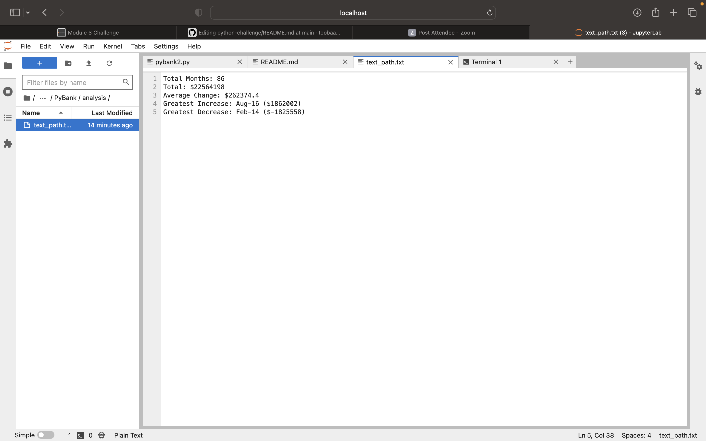

# Background

It's time to put away the Excel sheet and enter the world of programming with Python. In this assignment, you'll use the concepts you've learned to complete two Python challenges, PyBank and PyPoll. Both tasks present a real-world situation where your newly developed Python scripting skills come in handy.

---

## Before You Begin

Before starting the assignment, be sure to complete the following steps:
Create a new repository for this project called python-challenge. Do not add this homework assignment to an existing repository.
Clone the new repository to your computer.
Inside your local Git repository, create a folder for each Python assignment and name them PyBank and PyPoll.
In each folder that you just created, add the following content:
A new file called main.py. This will be the main script to run for each analysis.
A Resources folder that contains the CSV files you used. Make sure that your script has the correct path to the CSV file.
An analysis folder that contains your text file that has the results from your analysis.
Push these changes to GitHub or GitLab.

---

## PyBank Instructions

In this Challenge, you are tasked with creating a Python script to analyze the financial records of your company. You will be given a financial dataset called budget_data.csv. The dataset is composed of two columns: "Date" and "Profit/Losses".
Your task is to create a Python script that analyzes the records to calculate each of the following values:
The total number of months included in the dataset
The net total amount of "Profit/Losses" over the entire period
The changes in "Profit/Losses" over the entire period, and then the average of those changes
The greatest increase in profits (date and amount) over the entire period
The greatest decrease in profits (date and amount) over the entire period

-----

## PyPoll Instructions
You will be given a set of poll data called election_data.csv. The dataset is composed of three columns: "Voter ID", "County", and "Candidate". Your task is to create a Python script that analyzes the votes and calculates each of the following values:
The total number of votes cast
A complete list of candidates who received votes
The percentage of votes each candidate won
The total number of votes each candidate won
The winner of the election based on popular vote

!
